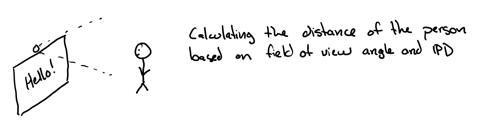
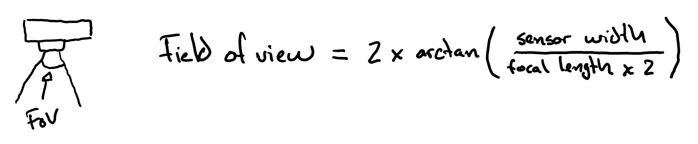
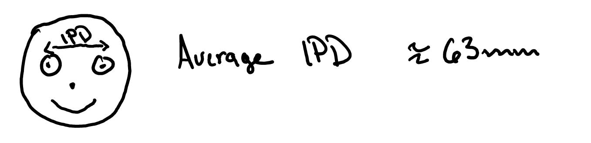
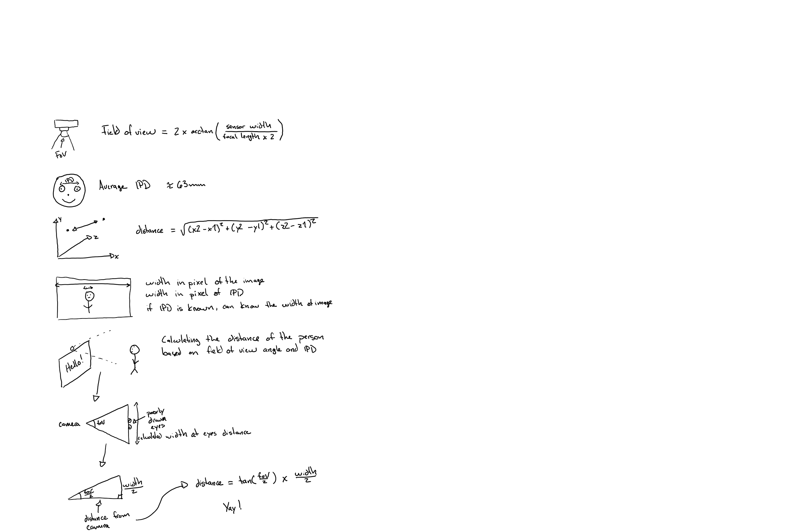
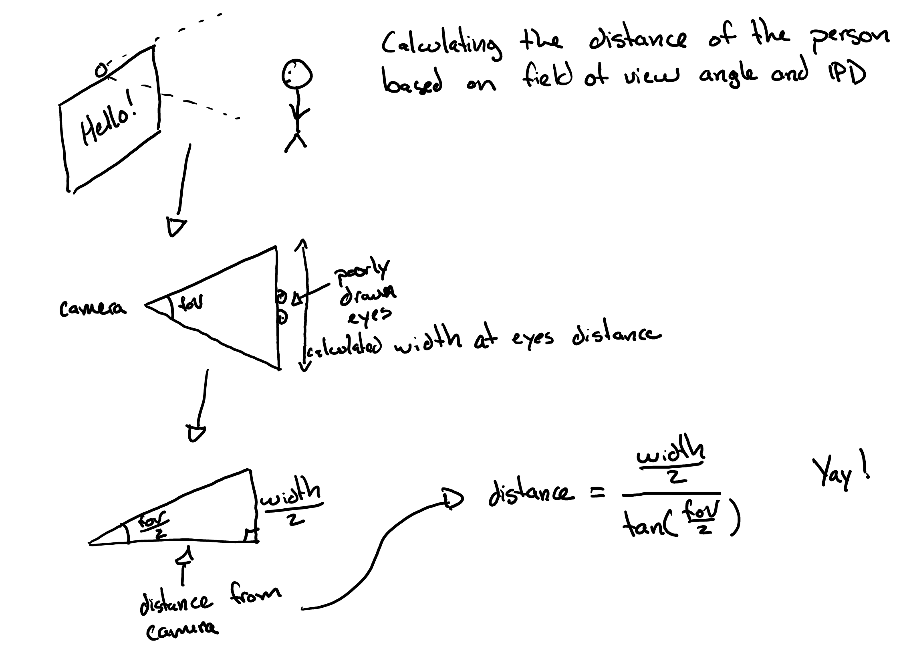

# Distance based messaging

This project is a proof of concept / small fun test using Machine Learning (Tensorflow.js) and the Blazeface and FaceLandmarks models.

The goal is to show a different message at a different size in the browser window.

Instead of using proximity sensors, we can use an average interpupillary distance and the field of view of the webcam and some geometry to calculate the approximate distance of a user from the webcam.

This project is mostly maths & geometry, but using a machine learning model to recognize a face and find the positions of the eyes was crucial for this project.

## Example of the finished project

Here I'm using the project at 3 different distances (<1m, >1m && <1.3m, >1.3m)

The scanning stops after showing the closest option.

## Thought process

Those are the steps that were taken, from drawing the problem to calculations.

### What do we want to achieve

We want to show a message based on the distance of someone. We will find out that distance with a webcam.

### FoV (Field of view)

To achieve our goal we can calculate the horizontal field of view angle so we have some starting information to find out at what distance the person is

On my current setup, I'm using a micro 4/3 camera with a lens at 22mm. That means an horizontal angle of view of 42.9°.

### Average interpupillary distance

On average, adults have an IPD of 63mm. 

That will be our baseline to calculate the distance of an user.

### Distance between two 3d points

Since we want to avoid problems with 2d coordinates, we are using a model that gives us 3d coordinates for each iris. 

This is how we will calculate the distance between our two points.

### Geometry

Since FoV is like an isosceles triangle, we can split it in two rectangle triangles. We know the height of one side so it is possible to calculate based on the ratio of IPD to width, then divided by two.

We can calculate the height of our isoceles triangle by using the tangeant.

# Sources

- https://www.pointsinfocus.com/tools/depth-of-field-and-equivalent-lens-calculator
- https://en.wikipedia.org/wiki/Pupillary_distance
- https://www.engineeringtoolbox.com/distance-relationship-between-two-points-d_1854.html